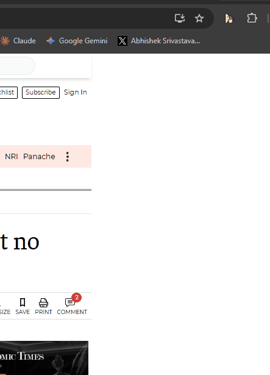

# Reading Mode AI

> Strip the noise. Read what matters.

A Chrome extension that automatically annotates any article with AI-powered insights — no typing required. One click gives you a TLDR, the 3 most important sentences verbatim, claims to fact-check, and a quality score.

## What it does

- **TLDR** — the entire article's point in 2 sentences
- **3 Key Sentences** — the most important verbatim quotes worth highlighting
- **Claims to Fact-Check** — specific unverified statements flagged with reasons
- **Article Quality Score** — bias level, evidence quality, reading difficulty
- **What's Missing** — the counterpoint or angle the article ignored

## How to use

1. Navigate to any news article or blog post
2. Click the extension icon
3. Hit **📖 Enter Reading Mode**
4. Get instant AI annotation in seconds

## Setup

1. Load the extension in Chrome (`chrome://extensions` → Developer Mode → Load unpacked)
2. Click ⚙ and paste your [Gemini API key](https://aistudio.google.com/apikey)
3. Done — works on any page

## Tech

- Chrome Extension Manifest V3
- Google Gemini API (with OpenRouter fallback)
- Two-phase progressive loading: instant metadata preview → full AI analysis

---

Built by [@happy_ships](https://x.com/happy_ships) · Day 3/180
